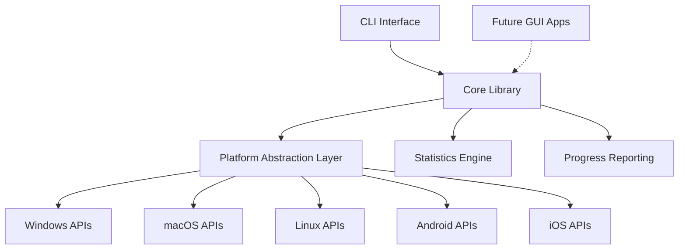
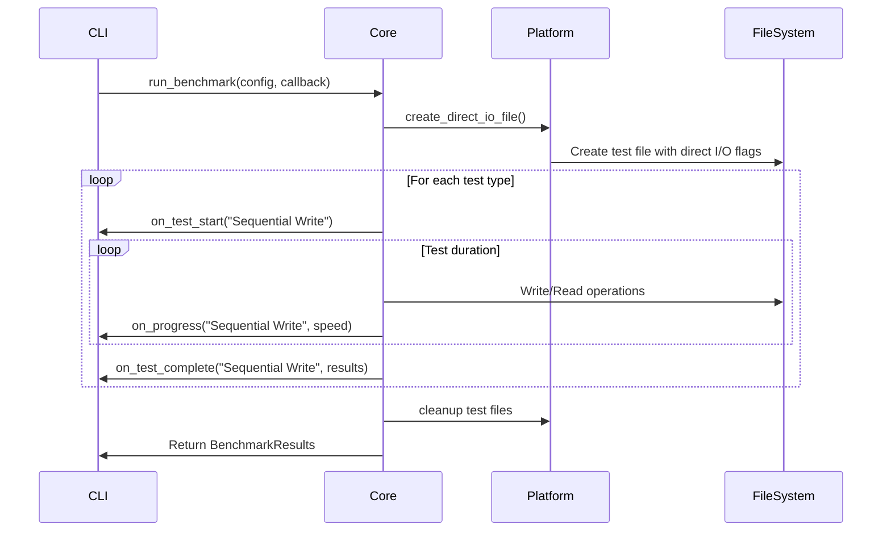

# Design Document

## Overview

The disk speed test utility will be implemented as a cross-platform application using Rust, which provides excellent cross-platform support including mobile platforms (Android/iOS), memory safety, and performance. The architecture separates the core benchmarking logic into a reusable library component that can be compiled for desktop (Windows, macOS, Linux) and mobile platforms (Android, iOS), with a command-line interface as the primary consumer.

The application will perform five distinct tests: Sequential Write, Sequential Read, Random Write, Random Read, and Memory Copy. Each test will bypass OS-level caching mechanisms using platform-specific APIs and provide real-time progress feedback with comprehensive statistics.

## Architecture

### High-Level Architecture



### Module Structure

```
disk-speed-test/
├── src/
│   ├── lib.rs              # Core library exports
│   ├── cli/
│   │   ├── mod.rs          # CLI module
│   │   ├── args.rs         # Command line argument parsing
│   │   ├── display.rs      # Output formatting and progress display
│   │   └── device_list.rs  # Device enumeration for CLI
│   ├── core/
│   │   ├── mod.rs          # Core benchmarking logic
│   │   ├── tests.rs        # Test implementations
│   │   ├── stats.rs        # Statistics collection and calculation
│   │   └── config.rs       # Test configuration structures
│   ├── platform/
│   │   ├── mod.rs          # Platform abstraction
│   │   ├── windows.rs      # Windows-specific implementations
│   │   ├── macos.rs        # macOS-specific implementations
│   │   ├── linux.rs        # Linux-specific implementations
│   │   ├── android.rs      # Android-specific implementations
│   │   └── ios.rs          # iOS-specific implementations
│   └── main.rs             # CLI entry point
├── Cargo.toml              # Rust project configuration
└── README.md
```

## Components and Interfaces

### Core Library Interface

```rust
pub struct BenchmarkConfig {
    pub target_path: PathBuf,
    pub sequential_block_size: usize,  // Default: 4MB
    pub random_block_size: usize,      // Default: 4KB
    pub test_duration_seconds: u64,    // Default: 10 seconds per test
    pub disable_os_cache: bool,        // Default: true
    pub file_size_mb: usize,          // Default: 1GB
}

pub struct BenchmarkResults {
    pub sequential_write: TestResult,
    pub sequential_read: TestResult,
    pub random_write: TestResult,
    pub random_read: TestResult,
    pub memory_copy: TestResult,
}

pub struct TestResult {
    pub min_speed_mbps: f64,
    pub max_speed_mbps: f64,
    pub avg_speed_mbps: f64,
    pub test_duration: Duration,
}

pub trait ProgressCallback: Send + Sync {
    fn on_test_start(&self, test_name: &str);
    fn on_progress(&self, test_name: &str, current_speed_mbps: f64);
    fn on_test_complete(&self, test_name: &str, result: &TestResult);
}

pub fn run_benchmark(
    config: BenchmarkConfig,
    progress_callback: Option<Box<dyn ProgressCallback>>
) -> Result<BenchmarkResults, BenchmarkError>;
```

### Platform Abstraction Layer

```rust
pub trait PlatformOps {
    fn list_storage_devices() -> Result<Vec<StorageDevice>, PlatformError>;
    fn get_app_data_dir() -> Result<PathBuf, PlatformError>;
    fn create_direct_io_file(path: &Path, size: u64) -> Result<File, PlatformError>;
    fn open_direct_io_file(path: &Path, write: bool) -> Result<File, PlatformError>;
    fn sync_file_system(path: &Path) -> Result<(), PlatformError>;
}

pub struct StorageDevice {
    pub name: String,
    pub mount_point: PathBuf,
    pub total_space: u64,
    pub available_space: u64,
    pub device_type: DeviceType,
}
```

### CLI Interface

The CLI will provide the following commands:
- `disk-speed-test list-devices` - List available storage devices
- `disk-speed-test benchmark [OPTIONS] <TARGET_PATH>` - Run benchmark tests
- `disk-speed-test --help` - Show usage information

Command line options:
- `--sequential-block-size <SIZE>` - Override default 4MB sequential block size
- `--random-block-size <SIZE>` - Override default 4KB random block size  
- `--duration <SECONDS>` - Test duration per benchmark (default: 10s)
- `--file-size <SIZE>` - Test file size (default: 1GB)
- `--enable-cache` - Enable OS caching (default: disabled)
- `--output-format <FORMAT>` - Output format: table, json, csv

## Data Models

### Test Execution Flow



### Statistics Collection

Each test will collect performance samples at regular intervals (every 100ms) to calculate:
- **Minimum Speed**: Lowest recorded speed during the test
- **Maximum Speed**: Highest recorded speed during the test  
- **Average Speed**: Mean of all collected samples
- **Sample Count**: Number of measurements taken

### Memory Copy Test Design

The memory copy test will:
1. Allocate two large memory buffers (matching test file size)
2. Perform memory-to-memory copies using optimized routines
3. Measure throughput to provide baseline memory bandwidth comparison
4. Use similar block sizes as disk tests for meaningful comparison

## Error Handling

### Error Categories

```rust
pub enum BenchmarkError {
    PlatformError(PlatformError),
    IoError(std::io::Error),
    ConfigurationError(String),
    InsufficientSpace(u64, u64), // required, available
    PermissionDenied(PathBuf),
    TestInterrupted(String),
}
```

### Error Recovery Strategies

1. **Insufficient Disk Space**: Automatically reduce test file size or suggest alternative location
2. **Permission Denied**: Provide guidance on running with appropriate permissions
3. **Device Unavailable**: Fall back to alternative device or app data directory
4. **Test Interruption**: Clean up partial test files and report partial results

## Testing Strategy

### Unit Tests

- **Core Logic Tests**: Test statistics calculation, configuration validation
- **Platform Abstraction Tests**: Mock platform operations for consistent testing
- **CLI Parsing Tests**: Verify command line argument handling

### Integration Tests

- **End-to-End CLI Tests**: Test complete CLI workflows with temporary directories
- **Cross-Platform Tests**: Automated testing on Windows, macOS, and Linux
- **Performance Regression Tests**: Ensure consistent benchmark behavior

### Platform-Specific Testing

- **Windows**: Test with NTFS, ReFS file systems and various drive types
- **macOS**: Test with APFS, HFS+ file systems and different device types
- **Linux**: Test with ext4, xfs, btrfs file systems and various mount options

### Test Data Management

- Use temporary directories for all test operations
- Implement proper cleanup in test teardown
- Test with various file sizes and block sizes
- Verify direct I/O flag effectiveness on each platform

## Mobile Platform Support

### Flutter Integration Strategy

The Rust core library can be integrated with Flutter applications using FFI (Foreign Function Interface):

1. **C-Compatible API**: Export core functions with C-compatible signatures
2. **Flutter FFI**: Use `dart:ffi` to call Rust functions from Dart
3. **Platform Channels**: Alternative approach using platform-specific bridges

```rust
// C-compatible exports for Flutter FFI
#[no_mangle]
pub extern "C" fn benchmark_run(
    config_ptr: *const BenchmarkConfigC,
    callback_ptr: *const c_void
) -> *mut BenchmarkResultsC;

#[no_mangle]
pub extern "C" fn benchmark_free_results(results: *mut BenchmarkResultsC);
```

### Mobile Platform Considerations

- **Android**: Storage access requires appropriate permissions in AndroidManifest.xml
- **iOS**: Sandboxed environment limits direct device access, focus on app sandbox testing
- **Battery Impact**: Implement power-aware testing with user consent for intensive operations
- **Thermal Management**: Monitor device temperature and throttle tests if needed

## Platform-Specific Implementation Details

### Windows Implementation
- Use `FILE_FLAG_NO_BUFFERING` and `FILE_FLAG_WRITE_THROUGH` for direct I/O
- Enumerate devices using `GetLogicalDrives()` and `GetDriveType()`
- Use `%LOCALAPPDATA%` for app data directory

### macOS Implementation  
- Use `F_NOCACHE` fcntl flag for cache bypassing
- Use `F_FULLFSYNC` for write synchronization
- Enumerate devices via `/Volumes` and system APIs
- Use `~/Library/Application Support` for app data

### Linux Implementation
- Use `O_DIRECT` and `O_SYNC` flags for direct I/O
- Parse `/proc/mounts` and `/sys/block` for device enumeration
- Use `~/.local/share` for app data directory
- Handle various filesystem-specific optimizations

### Android Implementation
- Use Android NDK for native file operations
- Request `WRITE_EXTERNAL_STORAGE` permission for external storage tests
- Use app-specific directories for internal storage tests
- Implement Java/Kotlin bridge for device enumeration via Android APIs

### iOS Implementation
- Work within app sandbox constraints
- Use iOS-specific APIs for available storage information
- Focus on app Documents and Cache directories
- Implement Objective-C bridge for iOS-specific device information